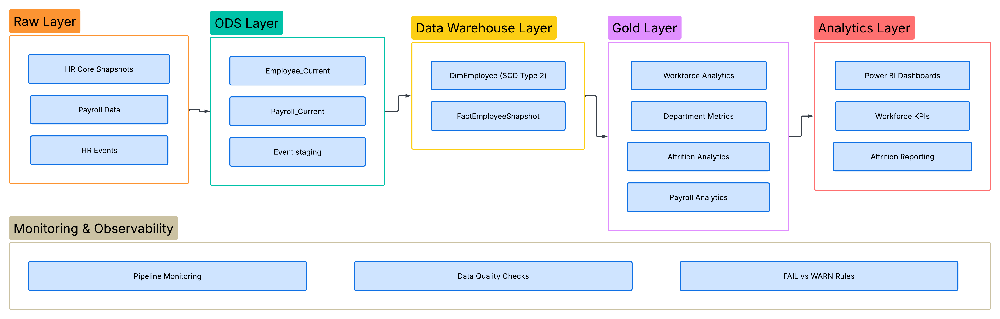
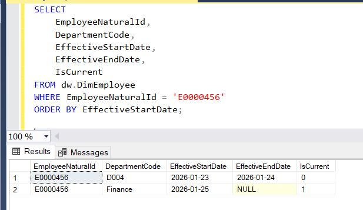
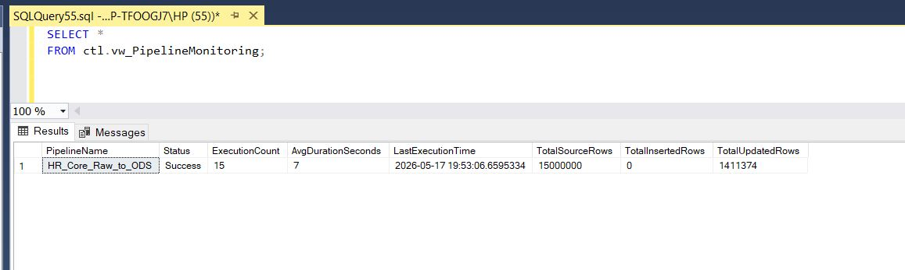
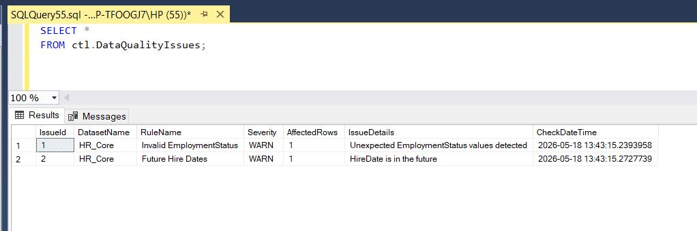
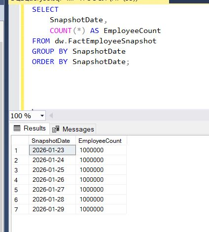

# Enterprise Workforce Lakehouse

## Project Overview

Enterprise Workforce Lakehouse is a production-style workforce analytics platform designed using modern data engineering and data warehousing principles.

The project simulates enterprise-scale HR, payroll, and workforce event processing using a layered Lakehouse architecture:

Raw → ODS → Data Warehouse → Gold Layer → Analytics

The platform focuses on:

- Incremental data processing
- Historical tracking
- Scalable ETL design
- Data quality and observability
- Workforce analytics

---

# Architecture

## Architecture Diagram



---

# Technology Stack

| Technology | Purpose |
|---|---|
| SQL Server | Data Warehouse & ETL |
| T-SQL | Data Processing |
| Python | Synthetic Data Generation |
| Pandas | Data Simulation |
| Power BI | Analytics & Reporting |
| GitHub | Version Control |

---

# Data Architecture

## Raw Layer

Simulated enterprise source systems:

- HR Core Snapshots
- Payroll Data
- HR Events

Key Features:
- Partitioned ingestion
- Immutable raw storage
- Large-scale synthetic datasets

---

## ODS Layer

Operational Data Store used for:

- Incremental loading
- Current-state employee tracking
- Watermark processing
- Hash-based change detection

Main Tables:
- Employee_Current
- Payroll_Current

---

## Data Warehouse Layer

Enterprise dimensional model with historical tracking.

Key Components:
- DimEmployee (SCD Type 2)
- FactEmployeeSnapshot

Implemented Concepts:
- Slowly Changing Dimensions (Type 2)
- Snapshot fact tables
- Historical workforce tracking

---

## Gold Layer

Business-ready analytical views.

Main Views:
- vw_WorkforceAnalytics
- vw_DepartmentMetrics
- vw_AttritionAnalytics
- vw_PayrollAnalytics

---

# Data Quality & Observability

Implemented operational monitoring features:

- Pipeline execution logging
- Data quality checks
- FAIL vs WARN validation logic
- Monitoring views
- Watermark tracking

---

# Project Scale

| Dataset | Volume |
|---|---|
| HR Snapshots | 1M+ rows/day |
| Snapshot Fact Table | 7M+ rows |
| Payroll Data | 900K+ rows/month |
| HR Events | 30K+ events/load |

---

# Screenshots

## SCD Type 2 Historical Tracking



---

## Pipeline Monitoring



---

## Data Quality Checks



---

## Snapshot Fact Volumes



---

## Gold Layer Analytics


---

# Repository Structure

```text
Enterprise-Workforce-Lakehouse/
│
├── sql/
│   ├── ods/
│   ├── dw/
│   ├── gold/
│   └── ctl/
│
├── python/
│   ├── generators/
│   └── pipelines/
│
├── screenshots/
│
└── README.md

```

## Future Improvements

- Apache Airflow orchestration
- Cloud deployment (Azure / AWS)
- Delta Lake implementation
- Spark-based distributed processing
- CI/CD pipeline integration


## Author

Elham Masoumi
